# Products Management Application en utilisant Angular Framework et Json-Server

## Introduction

Ce projet est une application de gestion de produits qui permet d'ajouter, de modifier, de supprimer et de consulter les produits. Il est développé en utilisant Angular Framework pour le frontend et Json-Server pour le backend.

## Structure du projet

```
   server.js (backend)
   data
    └───db.json
    ...
   src (frontend)
    ├───app
    │   ├───admin-template
    │   ├───app-errors
    │   ├───dashboard
    │   ├───edit-product
    │   ├───guards
    │   ├───home
    │   ├───login
    │   ├───model
    │   ├───navbar
    │   ├───new-product
    │   ├───not-authorized
    │   ├───products
    │   ├───services
    │   │       app-http.interceptor.ts
    │   │       app-state.service.ts
    │   │       auth.service.ts
    │   │       loader.service.ts
    │   │       product.service.ts
    ...
    │   │          
    │   └───assets
    ...        
```

## Fonctionnalités

- Authentification (en tant que admin ou user)
- Ajouter un produit
- Modifier un produit
- Supprimer un produit
- Consulter les produits
- Pagination
- Recherche par nom de produit

## Technologies utilisées

- Angular Framework
- Json-Server
- Json-Server Auth
- Bootstrap
- Bootstrap Icons

## Installation

1. Cloner le projet

   ```bash
   git clone https://github.com/anaserrami/Activite-Pratique-N4-Product-Management-using-Angular-Framework.git
    ```
2. Installer les dépendances

   ```bash
   cd Activite-Pratique-N4-Product-Management-using-Angular-Framework
   npm install
   ```
   
3. Démarrer le serveur pour le backend

   ```bash
    npm run server
    ```
   
4. Démarrer le server pour le frontend

   ```bash
    ng serve
    ```
   
5. Ouvrir le navigateur et accéder à l'adresse `http://localhost:4200/`

## Résultat

- **Login (par exemple : en tant que admin)**

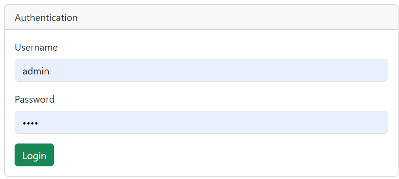


- **Dashboard**

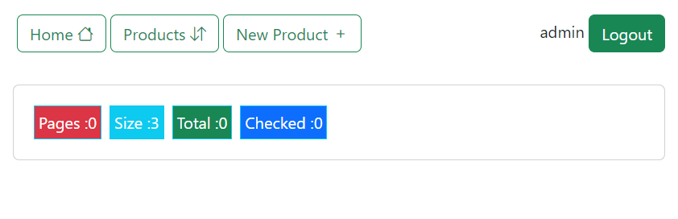

- **Consulter les produits**

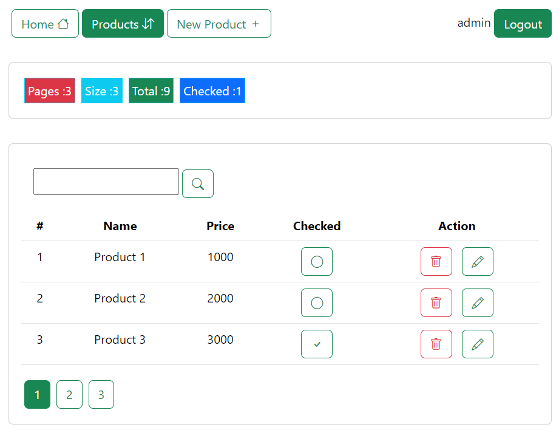

- **Pagination**

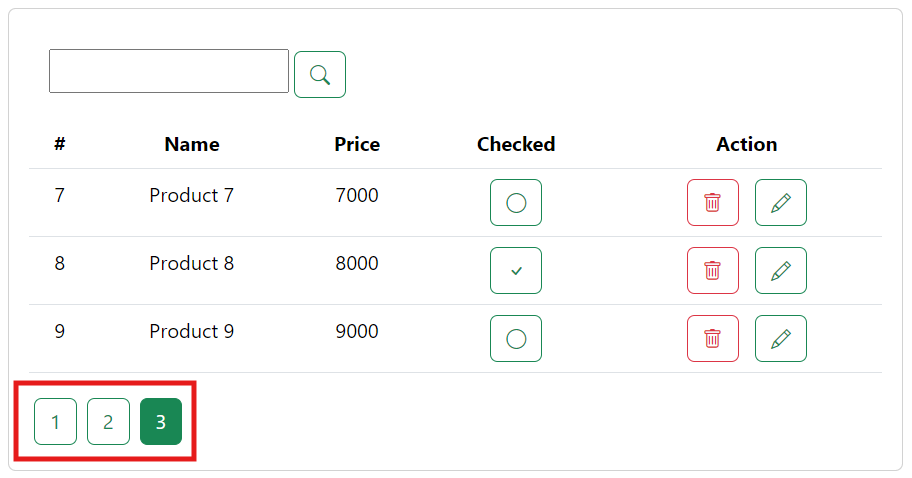

- **Recherche par nom de produit**

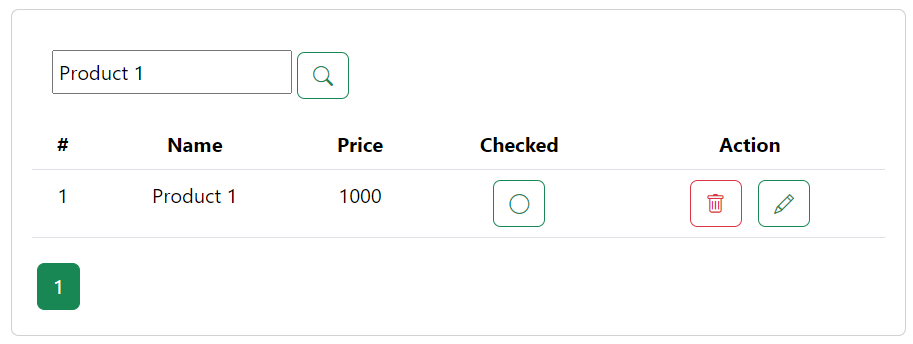

- **Ajouter un produit**

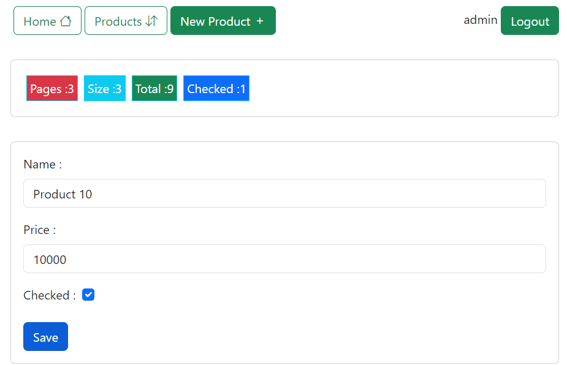
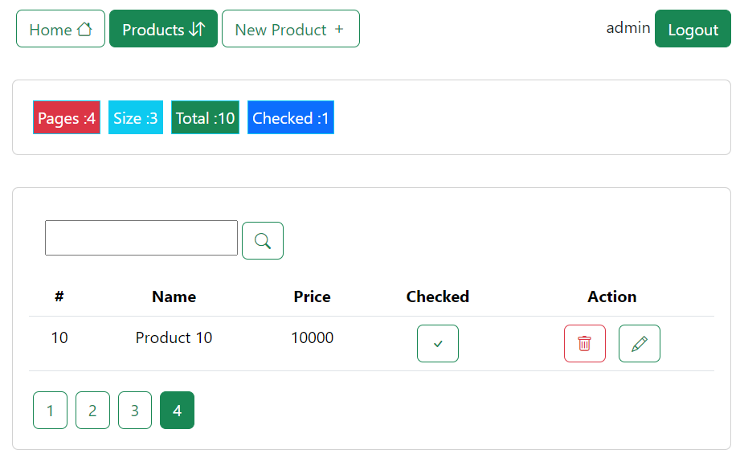

- **Modifier un produit**

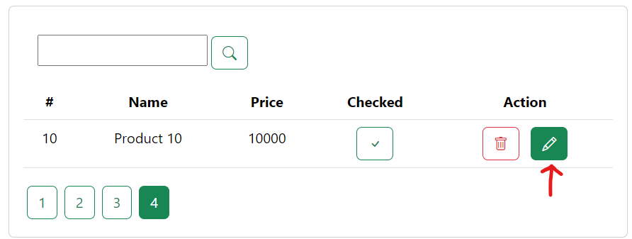
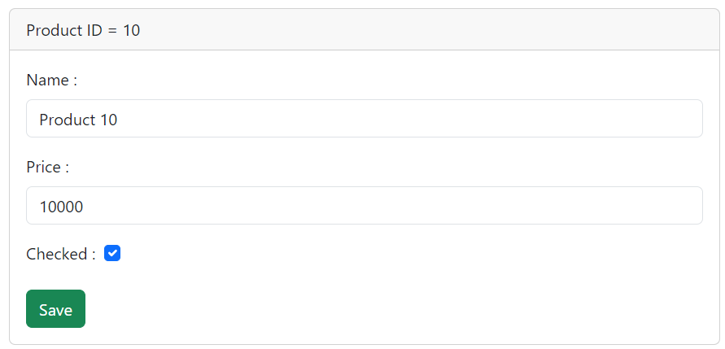
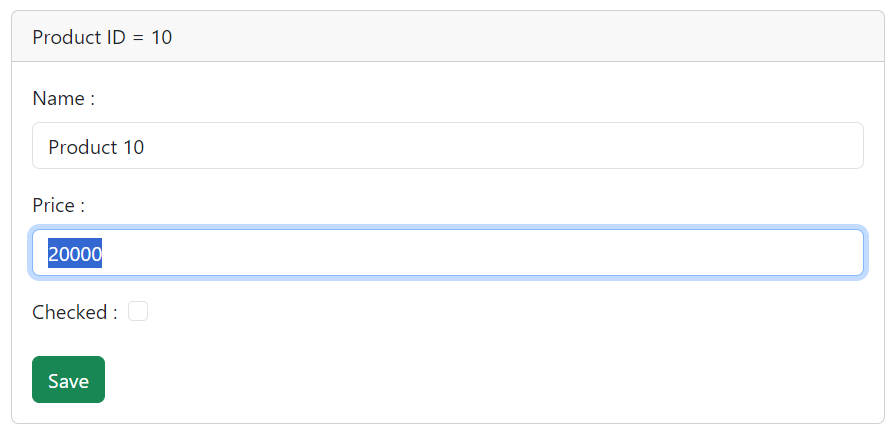
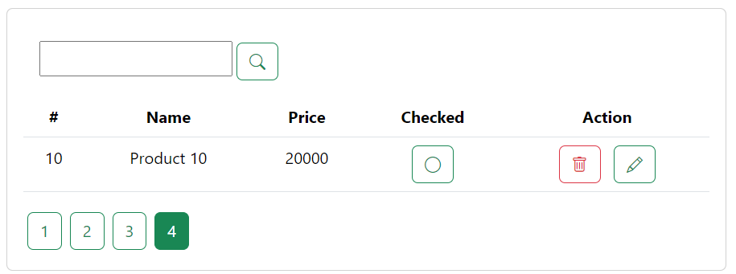

- **Supprimer un produit**

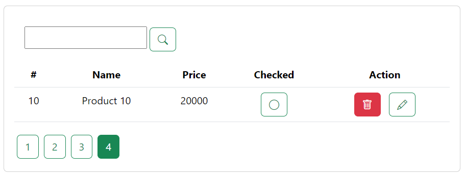
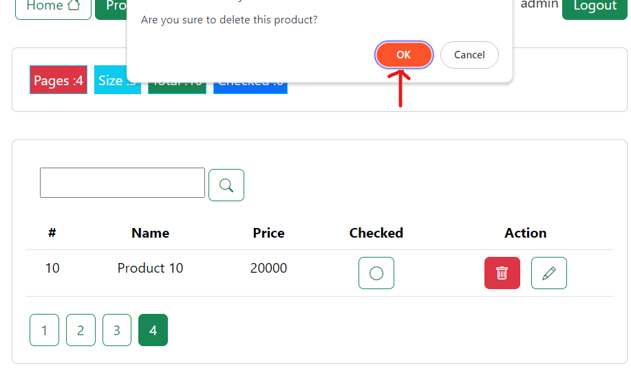
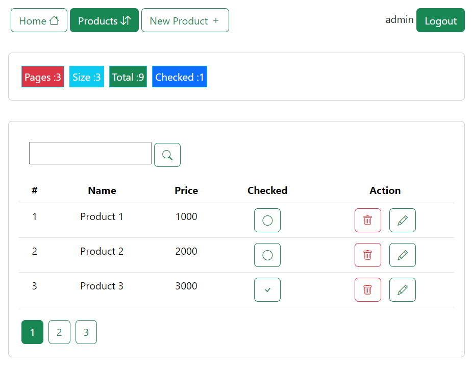

- **Logout**

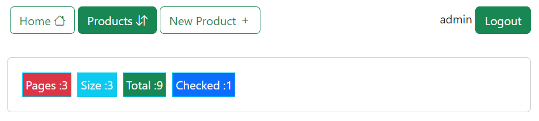
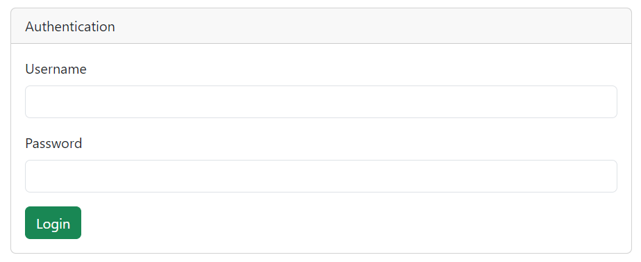
